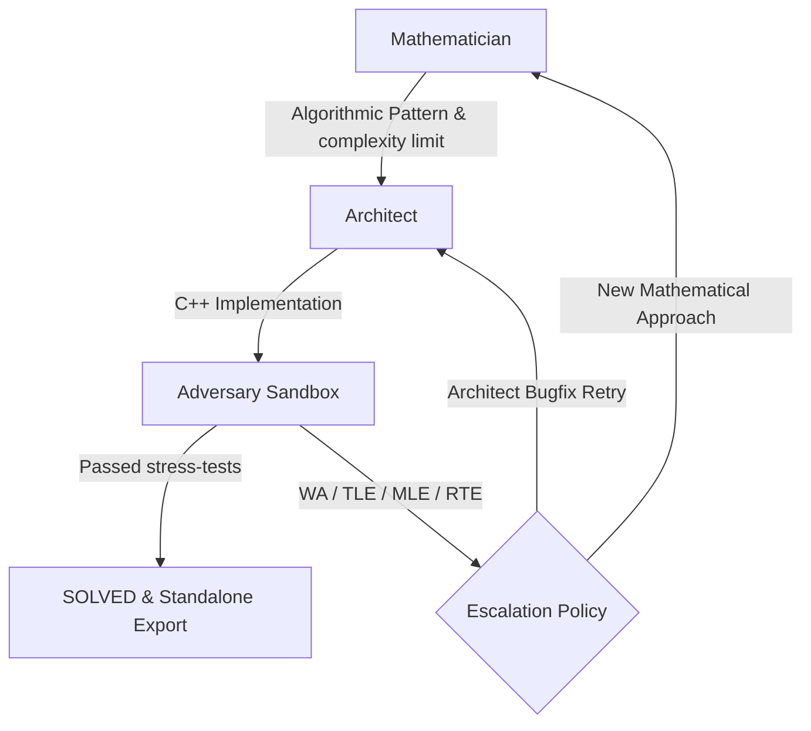

# Swarm Solver

A multi-agent self-correcting swarm designed to analyze, write, debug, and stress-test competitive programming solutions in C++. 

It coordinates three specialized agents (Mathematician, Architect, and Adversary) in a closed-loop sandbox environment, simulating the workflow of a high-performance team of software engineers.

---

## Architecture & Agent Workflow

The system employs a stateful loop to ensure code is structurally, logically, and resource-wise sound:



### The Swarm Roles
* **The Mathematician** (`agents/mathematician.py`): Parses constraints, establishes time/space complexity budgets, structures edge cases, and provides optimal algorithmic pseudocode (e.g., Two Pointers, Binary Search on Answer).
* **The Architect** (`agents/architect.py`): Translates the mathematical approach into clean, optimized C++ source code.
* **The Adversary** (`agents/adversary.py`): Acts as a QA engineer. It generates custom test cases and differential brute-force reference solutions to catch failures (Wrong Answer, Time Limit Exceeded, Memory Limit Exceeded, Run Time Error) in a resource-capped sandbox.

---

## Features
* **Web UI Dashboard**: A sleek, dark-mode, glassmorphic web dashboard to watch the swarm coordinate and debug in real-time via WebSockets.
* **Capped Execution Sandbox**: Cross-platform sandboxing using Win32 Job Objects (Windows) and `resource.setrlimit` (Linux) to catch infinite loops (TLE) and excessive memory consumption (MLE).
* **Google Gemini Free Tier Support**: Integration with the new `google-genai` SDK allowing full operation for free using Gemini API keys.
* **Self-Healing Rate Limits**: Dynamic delay parsing and natural request throttling (3s delay) to run cleanly under free-tier quota speed limits.
* **Clean Source Exporter**: Saves clean, compilable, stand-alone `.cpp` files to run directories upon successful solves.

---

## Project Structure
```
├── config/             # Agent prompts & system configurations
├── agents/             # Mathematician, Architect, Adversary, and Base Agent
├── orchestrator/       # Swarm pipeline state, retry, and escalation policies
├── execution/          # Sandboxed compilation & process execution runner
├── problems/           # Benchmark sets and custom problem schemas
├── static/             # Frontend assets (HTML, CSS, JS) for the dashboard
├── web_server.py       # FastAPI web server with WebSockets integration
├── benchmark.py        # Benchmark suite runner
└── cli.py              # CLI solve controller
```

---

## Setup & Installation

### 1. Clone & Install Dependencies
Ensure you have a C++ compiler (`g++` or `clang++` in PATH) and Python 3.11+ installed.
```bash
git clone https://github.com/your-username/cp-swarm.git
cd cp-swarm
python -m venv .venv
source .venv/bin/activate  # On Windows: .\.venv\Scripts\activate
pip install -r requirements.txt
pip install fastapi uvicorn google-genai
```

### 2. Configure Environment Variables
Create a `.env` file in the root directory:
```env
GEMINI_API_KEY=your_gemini_api_key_here
MATHEMATICIAN_MODEL=gemini-2.5-flash
ARCHITECT_MODEL=gemini-2.5-flash
ADVERSARY_MODEL=gemini-2.5-flash

CPP_COMPILE_TIMEOUT_SECONDS=10
CPP_RUN_TIMEOUT_SECONDS=5
CPP_MEMORY_LIMIT_MB=256

MAX_ARCHITECT_RETRIES=5
MAX_MATHEMATICIAN_ESCALATIONS=2

LOG_LEVEL=INFO
WORKSPACE_DIR=./workspace
LOGS_DIR=./logs/runs
```

---

##  Usage

###  Web Dashboard UI (Recommended)
Launch the FastAPI web server:
```bash
python -m uvicorn web_server:app --port 8000 --reload
```
Open **[http://localhost:8000](http://localhost:8000)** in your browser. Choose a benchmark problem or paste a custom one, click **"Run Swarm Solver"**, and trace agent decisions, C++ code blocks, and adversary tests live!

###  Benchmark Mode
Run the entire 5-problem benchmark suite from the terminal to generate a markdown table report:
```bash
python benchmark.py
```

###  CLI Solver
Solve a single problem file directly from the command line:
```bash
python cli.py solve problems/benchmarks/two_sum.txt
```

---

##  Deployment
A `Dockerfile` and `render.yaml` blueprint are provided for easy deployment to **Render** as a Dockerized Web Service.
1. Connect your repository to Render.
2. Select **Docker** environment.
3. Configure the environment variables (`GEMINI_API_KEY`).
4. Deploy! Render will build the container, install `g++`, and serve the dashboard globally with WebSockets enabled.
